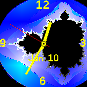

# banglejs-2-bitmap-clock-background #

fills the background of an analog clock on a Bangle.js 2 with a bitmap

This module fills the background of an analog clock face for the [Bangle.js 2](https://www.espruino.com/Bangle.js2) with a given bitmap.



> Note: if you plan to use a bitmap background, you should consider including [Widgets on Background](https://github.com/rozek/banglejs-2-widgets-on-background) (as shown in the examples) in order to prevent widgets from erasing parts of that backgropund again.

## Usage ##

Within a clock implementation, the module may be used as follows:

```
require('https://raw.githubusercontent.com/rozek/banglejs-2-widgets-on-background/main/drawWidgets.js');

let Clockwork = require(...);
Clockwork.windUp({
  background: require('https://raw.githubusercontent.com/rozek/banglejs-2-bitmap-clock-background/main/ClockBackground.js.js'),
  ...
}, { Bitmap:'...' });
```

`Settings.Bitmap` should contain the file name of the bitmap to be drawn - that bitmap must have been properly converted for the Bangle.js 2 and uploaded into the storage area before.

## Example ##

The following code shows a complete example for a (still simple) analog clock using this clock size calculator:

```
require('https://raw.githubusercontent.com/rozek/banglejs-2-widgets-on-background/main/drawWidgets.js');

let Clockwork = require('https://raw.githubusercontent.com/rozek/banglejs-2-simple-clockwork/main/Clockwork.js');

Clockwork.windUp({
  background:require('https://raw.githubusercontent.com/rozek/banglejs-2-bitmap-clock-background/main/ClockBackground.js'),
  face:      require('https://raw.githubusercontent.com/rozek/banglejs-2-four-fold-face/main/ClockFace.js'),
  complications:{
    b:require('https://raw.githubusercontent.com/rozek/banglejs-2-date-complication/main/Complication.js')
  }
},{
  Foreground:'#FFFF00', Background:'#000000', Seconds:'#FF00',
  Bitmap:'Mandelbrot_176x176.png'
});
```

## License ##

[MIT License](LICENSE.md)
